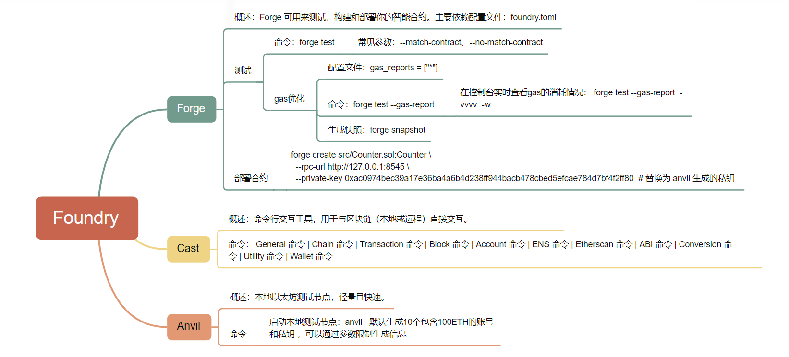
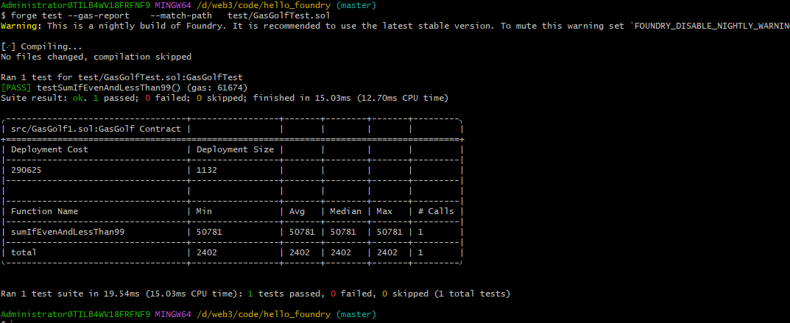
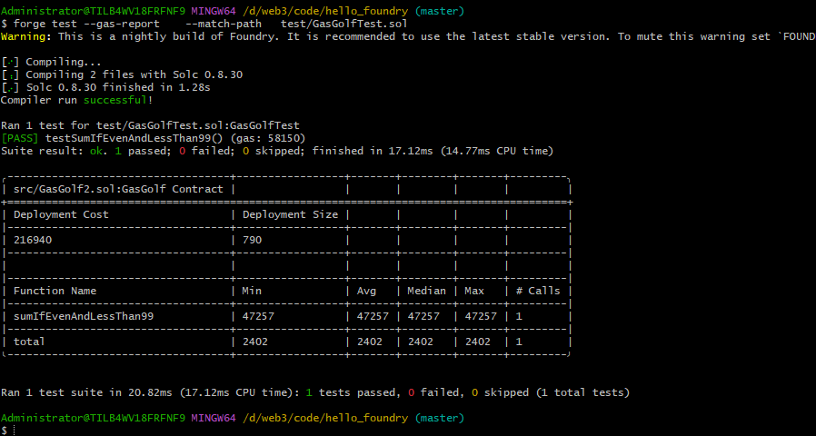

Foundry 框架作为智能合约测试 / 部署 / 调试全流程工具链的主要组成部分及其功能。




Gas 优化策略：
1. 优先使用calldata
2. 加载状态变量到内存变量
3. 多个条件判断使用短路方式
4. 在循环中使用++i，而不是i+=1,i++
5. 数组长度缓存到内存
6. 缓存多次使用的数组元素到内存

按照上述策略，gas优化示例代码如下：
## gas优化之前的代码
```  

contract GasGolf {
    // start -? gas
    // use calldata
    // load state variables to memory
    // short circuit
    // loop increments
    // cache array length
    // load array elements to memory

    uint public total;

    // [1, 2, 3, 4, 5, 100]
    function sumIfEvenAndLessThan99(uint[] memory nums) external {
        for (uint i = 0; i < nums.length; i += 1) {
            bool isEven = nums[i] % 2 == 0;
            bool isLessThan99 = nums[i] < 99;
            if (isEven && isLessThan99) {
                total += nums[i];
            }
        }
    }
}


```


## gas优化之后的代码
```  
// SPDX-License-Identifier: UNLICENSED
pragma solidity ^0.8.13;
contract  GasDemo{
uint public total;
// [1, 2, 3, 4, 5, 100]
function sumIfEvenAndLessThan99(uint[] calldata nums) {
    uint _total = total;
    uint len = nums.length;
    for (uint i = 0; i < len; ++i) {
        uint num = nums[i];
        if (num % 2 == 0 && num < 99) {
            _total += num;
        }
    }
    total = _total;
}
}
```


Gas 优化报告，通过命令 forge test --gas-report ：
優化之前的gas報告：


優化之後的gas報告：
